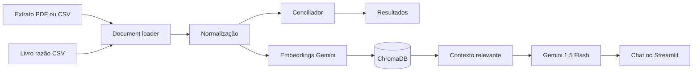

# Conciliações Bank F.G.R.Q. · Conciliação bancária com IA

<div align="center">

**Transforme arquivos financeiros em decisões mais rápidas e confiáveis.**

Compare extratos bancários com o livro razão, encontre divergências e converse com os dados usando linguagem natural.

[](https://challenge-conciliacao-ia-fgrq-tvcazycfy6ioyq8dtglgjx.streamlit.app)
[](https://www.python.org/)
[](https://streamlit.io/)

**Challenge Oracle + Alura · ONE AI for Tech · G10 Brasil**

</div>

> **Demo online:** [abrir o Conciliações Bank F.G.R.Q. no Streamlit Community Cloud](https://challenge-conciliacao-ia-fgrq-tvcazycfy6ioyq8dtglgjx.streamlit.app)

## Índice

- [Visão geral](#visão-geral)
- [O que a aplicação faz](#o-que-a-aplicação-faz)
- [Como funciona](#como-funciona)
- [Comece em poucos minutos](#comece-em-poucos-minutos)
- [Arquivos de entrada](#arquivos-de-entrada)
- [Pergunte aos dados](#pergunte-aos-dados)
- [Estrutura do projeto](#estrutura-do-projeto)
- [Configurações](#configurações)

## Visão geral

O **Conciliações Bank F.G.R.Q.** aplica RAG (*Retrieval-Augmented Generation*) à conciliação bancária. A aplicação recebe um extrato bancário em PDF ou CSV e um livro razão em CSV, normaliza os dados, cruza os lançamentos e apresenta os resultados em uma interface Streamlit.

O resultado é uma visão prática do que foi conciliado, do que está pendente e de onde existem diferenças de data, valor ou descrição. Depois, o agente Gemini permite investigar esses dados em um chat, sempre usando os documentos carregados como contexto.

## O que a aplicação faz

| Etapa | Resultado |
| --- | --- |
| **Importa** | Lê extratos em PDF/CSV e livros razão em CSV. |
| **Entende** | Detecta variações de nomes de colunas e normaliza os registros. |
| **Concilia** | Compara data, valor e similaridade da descrição com tolerâncias configuráveis. |
| **Explica** | Organiza conciliados, pendências e divergências em tabelas. |
| **Responde** | Usa embeddings e o Gemini para responder perguntas sobre os documentos. |

## Como funciona



**Fluxo de uso:** faça o upload dos dois arquivos, ajuste as tolerâncias na barra lateral, execute a conciliação e abra a aba de resultados ou o chat.

## Tecnologias

`Python` · `Streamlit` · `Pandas` · `PyPDF` · `ChromaDB` · `LangChain` · `Google Gemini`

| Tecnologia | Papel no projeto |
| --- | --- |
| Streamlit | Interface web interativa |
| Pandas | Leitura, transformação e análise dos dados |
| PyPDF | Extração de texto de extratos em PDF |
| ChromaDB | Armazenamento e busca vetorial |
| Gemini Embeddings | Representação semântica dos documentos |
| Gemini 1.5 Flash | Respostas em linguagem natural |

## Comece em poucos minutos

### Pré-requisitos

- Python 3.10 ou superior
- Uma chave de API do [Google AI Studio](https://aistudio.google.com/)

### Instalação

```bash
git clone https://github.com/fabio-guilherme-82/challenge-conciliacao-ia-fgrq.git
cd challenge-conciliacao-ia-fgrq
python -m venv venv
```

Ative o ambiente virtual e instale as dependências:

```bash
# Windows PowerShell
.\venv\Scripts\Activate.ps1

# Linux/macOS
source venv/bin/activate

pip install -r requirements.txt
```

Configure a chave no ambiente antes de iniciar:

```bash
# Windows PowerShell
$env:GOOGLE_API_KEY="sua_chave_aqui"

# Linux/macOS
export GOOGLE_API_KEY="sua_chave_aqui"
```

Execute a aplicação:

```bash
streamlit run app.py
```

Acesse `http://localhost:8501` no navegador. No Streamlit Cloud, configure `GOOGLE_API_KEY` em **Settings → Secrets**.

## Arquivos de entrada

### Extrato bancário

Aceita **PDF com texto selecionável** ou CSV. Para CSV, as colunas podem usar nomes equivalentes:

| Campo | Variações reconhecidas |
| --- | --- |
| Data | `data`, `date`, `dt`, `data_mov`, `data_transacao` |
| Descrição | `descricao`, `historico`, `desc`, `detalhe` |
| Valor | `valor`, `vlr`, `amount`, `val` |
| Tipo | `tipo`, `natureza`, `operacao`, `debito_credito`, `dc` |
| Saldo | `saldo`, `saldo_atual`, `balance` |

```csv
data,descricao,valor,tipo,saldo
01/08/2026,SALDO ANTERIOR,0.00,,15000.00
02/08/2026,PAGAMENTO FORNECEDOR ABC,-2500.00,D,12500.00
03/08/2026,RECEBIMENTO CLIENTE XYZ,3200.00,C,15700.00
```

### Livro razão

O CSV deve conter data, descrição e valor. `conta`, `documento` e `tipo` também são reconhecidos quando presentes.

```csv
data,descricao,valor,conta,documento,tipo
02/08/2026,PAGTO FORNECEDOR ABC,2500.00,21101,001234,D
03/08/2026,REC CLIENTE XYZ,3200.00,11201,005678,C
```

Os arquivos prontos para teste estão em [`data/`](data/): `extrato_bancario_exemplo.csv` e `livro_razao_exemplo.csv`.

## Pergunte aos dados

Depois da conciliação, experimente perguntas como:

- **Conciliação:** “Qual a taxa de conciliação deste mês?”
- **Pendências:** “Quais lançamentos do extrato não foram conciliados?”
- **Valores:** “Qual o saldo final do extrato bancário?”
- **Divergências:** “Há diferenças de valor entre extrato e razão?”
- **Análise:** “Resuma os principais pontos de atenção desta conciliação.”

## Estrutura do projeto

```text
challenge-conciliacao-ia-fgrq/
├── app.py                 # Interface Streamlit
├── agent.py               # RAG com Gemini e ChromaDB
├── document_loader.py     # Leitura e normalização de PDFs/CSVs
├── conciliador.py         # Matching e detecção de divergências
├── data/                  # Arquivos CSV de exemplo
├── requirements.txt       # Dependências
└── README.md              # Documentação
```

## Configurações

Na barra lateral, ajuste os parâmetros que controlam o matching:

| Parâmetro | Padrão | O que controla |
| --- | ---: | --- |
| Tolerância de dias | `3` | Diferença máxima entre as datas |
| Tolerância de valor | `R$ 0,01` | Diferença máxima aceitável nos valores |
| Similaridade mínima | `0,4` | Semelhança mínima entre descrições, de 0 a 1 |

## Deploy

A aplicação está publicada no **Streamlit Community Cloud**. Para criar seu próprio deploy:

1. Conecte o repositório ao [Streamlit Cloud](https://streamlit.io/cloud).
2. Selecione `app.py` como arquivo principal.
3. Configure `GOOGLE_API_KEY` em **Settings → Secrets**.
4. Publique a aplicação.

## Licença e autoria

Projeto educacional desenvolvido para o **Challenge Alura-Oracle ONE G10**.

**Fabio Guilherme** · [GitHub](https://github.com/fabio-guilherme-82)

> Automatizando a contabilidade com inteligência artificial.
